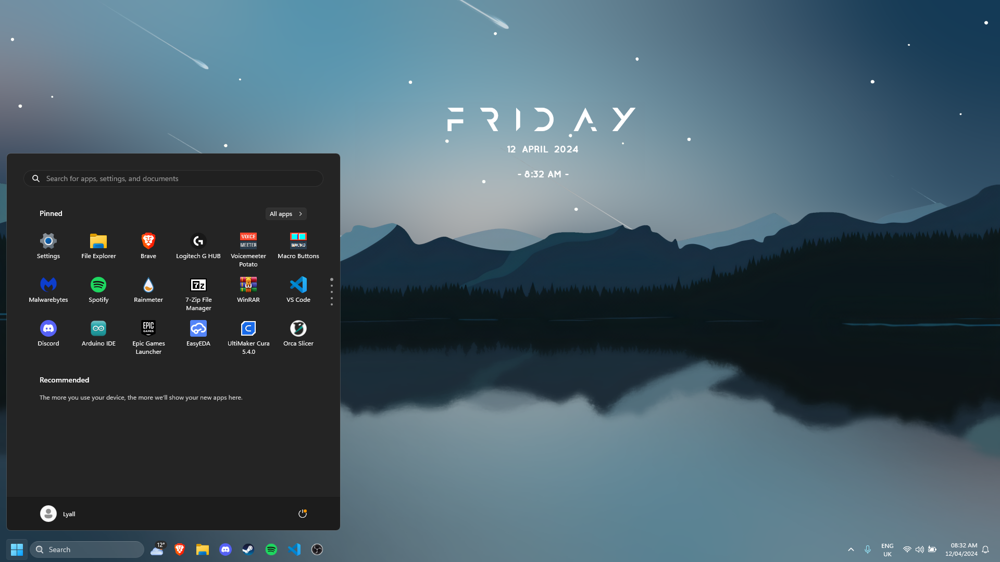

# [My Windows setup guide :3 (FOR ME ONLY)](https://www.microsoft.com/software-download/windows11)

## Windows Setup
* Do NOT sign in with Microsoft
  * Run `OOBE\BYPASSNRO` to bypass sign in
  * If that doesn't work (may be removed in new versions), open regedit and create a new `Dword (32-bit) value` key called `BypassNRO` with the value `1` at `HKEY_LOCAL_MACHINE\SOFTWARE\Microsoft\Windows\CurrentVersion\OOBE`
* Reject all privacy/telemetry settings

## Setup
For after Windows install, can be modified based on your needs
* Activate Windows by running `irm https://get.activated.win | iex` in PowerShell
* Run `bcdedit /set {globalsettings} highestmode on` to use high resolution during boot
* Install applications/packages with WinGet, see [WinGet packages.txt](./WinGet%20packages.txt) for a list (`winget install --id <id>`)
  * If any packages fail to install, install through browser (AKA the normal way)
* Install any other applications you need
* Disable unnecessary programs in Task Manager Startup apps
* Create SSH key with `ssh-keygen -t rsa -b 4096 -C "A description"`
* Organise Start menu
* Organise taskbar and system tray
* Set [settings](#settings)
* Set [application settings](#application-settings)

## Settings
* **System > About > Rename this PC**
  * Set your PC name
* **System > Clipboard > Clipboard history**: `On`
* **System > Notifications > Turn on do not disturb automatically**
  * When duplicating your display (priority notification banners are also hidden): `Off`
  * When playing a game: `Off`
  * When using an app in full-screen mode (priority notifaction banners are also hidden): `Off`
  * For the first hour after a Windows feature update: `Off`
* **System > Sound**:
  * Set Output and Input devices
* **Bluetooth & devices > Mouse > Additional mouse settings > Pointer Options > Enhance pointer precision**: `Off`
* **Personalisation > Background > Personalize your background**: `Picture`
* **Personalisation > Colours > Choose your mode**: `Dark`
* **Personalisation > Dynamic Lighting > Use Dynamic Lighting on my devices**: `Off`
* **Personalisation > Lock screen > Lock screen status**: `None`
* **Personalisation > Start**:
  * Show recently added apps: `On`
  * Show the most used apps: `On`
  * Show recently opened items in Start, recent files in File Explorer and items in Jump Lists: `Off`
  * Show recommendations for tips, shortcuts, new apps, and more: `Off`
  * Show account-related notifications: `Off`
* **Personalisation > Taskbar > Taskbar items**:
  * Search: `Search box`
  * Copilot (preview): `Off`
  * Task view: `Off`
  * Widgets: `Off`
* **Personalisation > Taskbar > Taskbar behaviours**:
  * Taskbar alignment: `Left`
* **Accessibility > Keyboard**: Go to `Sticky keys` and `Filter keys` and turn off `Keyboard shortcut for x`

## Application Settings
### File Explorer
  * **View > Show**:
    * File name extensions: `On`
    * Hidden items: `On`
  * **... > Options > General**:
    * Open File Explorer to: `This PC`
    * **Privacy**:
      * All unchecked
### Winaero Tweaker
  * **File > Import/Export Tweaks > Import tweaks from a file > Next > Browse**:
    * Select Winaero Tweaker config
    * Next > Finish
### Voicemeeter
  * **Menu**:
    * Auto Restart Audio Engine (A1 Device): `Checked`
    * System Tray: `Checked`
    * Run on Windows Startup: `Checked`
    * **Load Settings...**:
      * Select Voicemeeter config
### Macro Buttons
  * System Tray (Close = Hide): `Checked`
  * Store Last Buttons State: `Checked`
  * Run MacroButtons on Voicemeeter start: `Checked`
  * **Load Button Map**:
    * Select Macro Buttons config
### Brave
  * **Sync > Start using sync > I have a Sync Code**:
    * Enter sync code
  * **Sync > Manage your synced devices > Sync Settings**: `Sync everything`
  * **Get started > On startup**: `Open the New Tab page` or `Open a specific page or set of pages`
  * **Get started > New tab page > Customize new tab page**:
    * Background Image: `Off`
    * Brave Stats: `Off`
    * Top Sites: `Off`
    * Clock: `On`
    * Cards: `Off`
    * Search: `Off`
  * **Appearance > Toolbar**:
    * Show Home button: `Off`
    * Show bookmarks button: `On`
    * Show bookmarks bar: `Always`
    * Show Brave News button: `Off`
    * Show Leo AI button: `Off`
    * Show Brave Rewards button: `Off`
    * Show Brave Wallet button: `Off`
    * Show sidebar button: `Off`
    * Show VPN button: `Off`
    * **Show autocomplete suggestions in address bar**:
      * All unchecked except `Bookmarks` and `Quick commands`
    * Use wide address bar: `On`
    * Always show full URLs: `On`
  * **Search engine > Normal Window**: `Google`
  * **Extensions > Violentmonkey**:
    * Import all your scripts
  * **Autofill and passwords > Allow auto-fill in private windows**: `Off`
  * **Downloads > Ask where to save each file before downloading**: `Off`
  * **System > Warn me before closing window with multiple tabs**: `Off`
### Spotify
  * **Your Library > Show Local Files**: `On`
    * Turn on `Music Library`
  * **Audio quality**:
    * Streaming quality: `High` or `Very high` with Premium
    * Download: `Very high` with Premium
    * Auto-adjust quality: `Off`
    * Normalise volume: `Off`
  * **Playback > Automix**: `Off`
  * **Start-up and window behaviour**:
    * Open Spotify automatically after you log in to the computer: `Minimised`
    * Close button should minimise the Spotify window: `On`
### Logitech G Hub
  * Allow games & applications to control illumination: `Unchecked`
  * Desktop notifications: `Unchecked`
  * Device recommendation: `Unchecked`

## Other applications not yet added to [Application Settings](#application-settings):
* OBS Studio
* ShareX
* OpenRGB